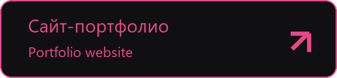
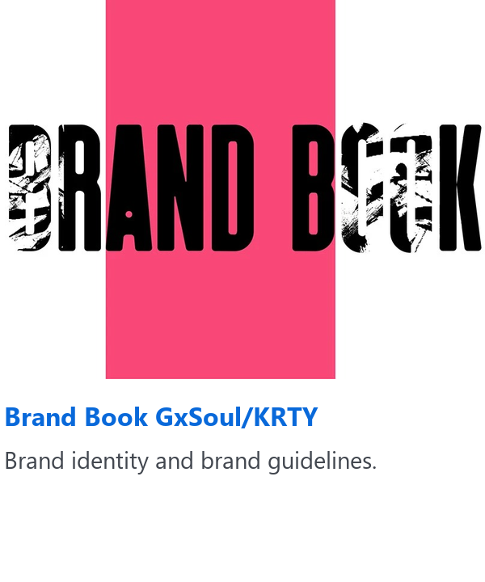
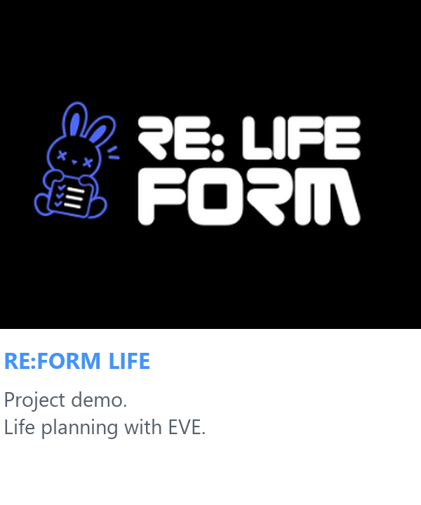
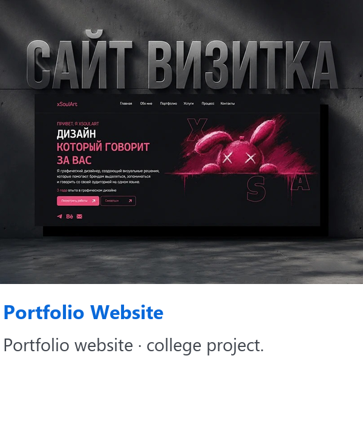
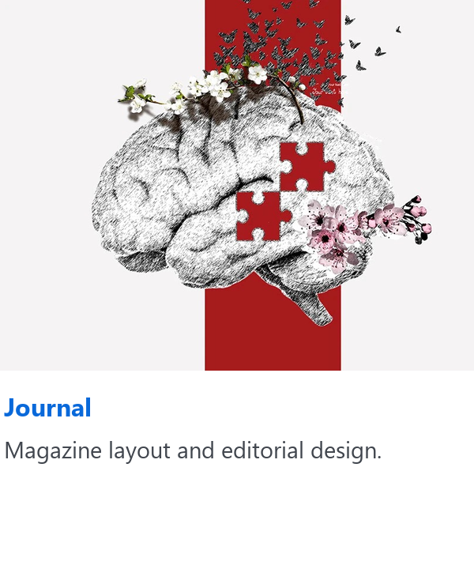
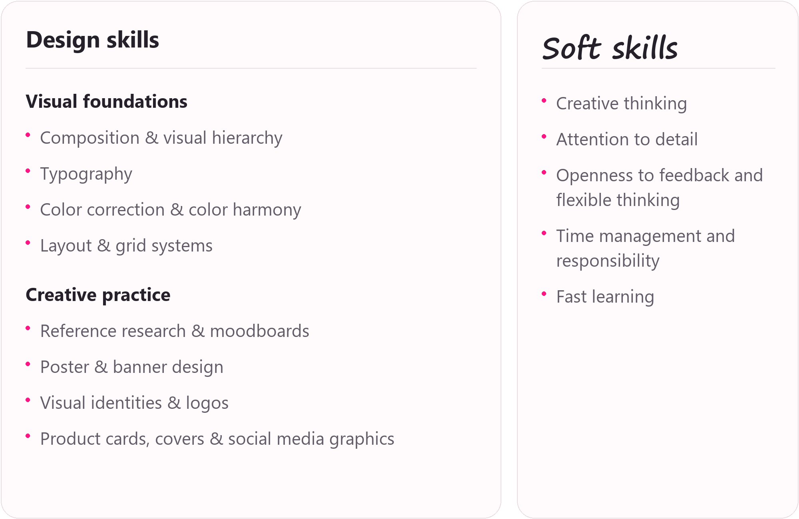
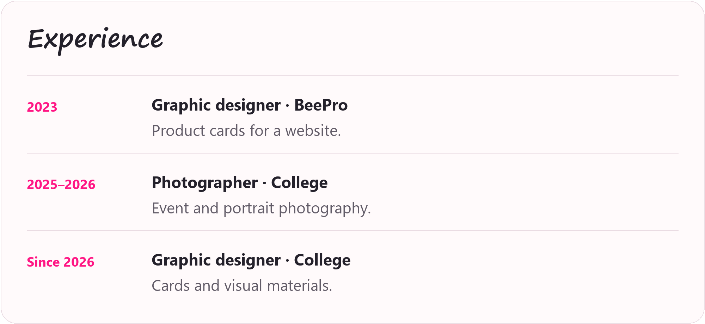
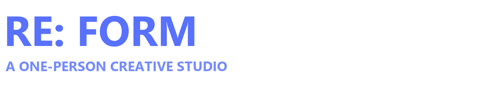

<a href="README.ru.md">Русский</a> · <b>English</b>

<a href="#work">Selected work</a> · <a href="#about">About me</a> · <a href="#services">Services</a> · <a href="#tools">Tools & skills</a> · <a href="#experience">Experience</a> · <a href="#reform">RE: FORM</a> · <a href="#contact">Contact</a>

<h3>SoulArt / KRTY</h3>
<h3>Maria Matveeva</h3>

<b>GRAPHIC | MULTIDISCIPLINARY DESIGNER</b>

Turning ideas into visual stories. Design with character. No boring solutions.

 &nbsp; 

<b>Design channel:</b> <a href="https://t.me/soulamigo">@soulamigo ↗</a>

RUSSIA · DESIGNING SINCE 2022

 

### Work

<a href="https://www.behance.net/gallery/246885793/Brand-Book-GxSoulKRTY"><picture><source media="(prefers-color-scheme: dark)" srcset="assets/work-brandbook-en-dark.png"></picture></a> &nbsp;
<a href="https://www.behance.net/gallery/256292513/Demo-version-of-the-project-RE-FORM-LIFE"><picture><source media="(prefers-color-scheme: dark)" srcset="assets/work-reform-life-behance-en-dark.png"></picture></a> &nbsp;
<a href="https://www.behance.net/gallery/251160601/Portfolio-Website"><picture><source media="(prefers-color-scheme: dark)" srcset="assets/work-portfolio-en-dark.png"></picture></a> &nbsp;
<a href="https://www.behance.net/gallery/229126569/Journal-Full-fledged-layout-of-the-magazine"><picture><source media="(prefers-color-scheme: dark)" srcset="assets/work-journal-en-dark.png"></picture></a>

[Explore my full portfolio →](https://www.behance.net/tuumiyurmirazh/projects)

### About me

I work in design, create all kinds of things and refine every project into something beautiful. If you're looking for visuals that are stylish, polished and eye-catching, you're in the right place.

· **Graphic designer** — posters, covers, product cards and social media graphics.  
· **UI/UX** — visual design for websites and apps.  
· **Visual identity** — logos and brand visuals.  
· **Editorial design** — magazine layouts, composition and typography.  
· **Photographer** — events and portraits.

Based in Russia and designing since 2022. I develop my skills through personal and academic projects and welcome creative collaborations.

**Contact me:** [@designeramigo](https://t.me/designeramigo)  
**Design channel:** [@soulamigo](https://t.me/soulamigo)  
**Photography on TikTok:** [@xkartaviyx_](https://www.tiktok.com/@xkartaviyx_) · **Instagram:** [@xgxsoul_kartaviyx](https://www.instagram.com/xgxsoul_kartaviyx/)

### Services

 &nbsp;
 &nbsp;
 &nbsp;
 &nbsp;
 &nbsp;

### Tools & skills

 &nbsp;
 &nbsp;
 &nbsp;
 &nbsp;
 &nbsp;

Illustrator · Photoshop · Figma · InDesign · Lightroom

<picture><source media="(prefers-color-scheme: dark)" srcset="assets/skills-box-en-dark.png"></picture>

Read the full text

### Design skills

**Visual foundations**

- Composition & visual hierarchy
- Typography
- Color correction & color harmony
- Layout & grid systems

**Creative practice**

- Reference research & moodboards
- Poster & banner design
- Visual identities & logos
- Product cards, covers & social media graphics
### Soft skills

- Creative thinking
- Attention to detail
- Openness to feedback and flexible thinking
- Time management and responsibility
- Fast learning

### Languages

**Russian** — Native  
**English** — Basic

### Experience & education

<picture><source media="(prefers-color-scheme: dark)" srcset="assets/experience-box-en-dark.png"></picture>

Read the full text

### Experience

- **Graphic designer · BeePro · 2023** — Product cards for a website.
- **Photographer · College · 2025-2026** — Event and portrait photography.
- **Graphic designer · College · Since 2026** — Cards and visual materials.

### Education

**IT TOP Academy · Graphic Design · 2023-2025**  
Composition, typography, color, visual identity and digital design. Practical work and contemporary design approaches.

<h3>MY TEAM — RE: FORM</h3>
<b>RE: FORM</b> is not a team in the traditional sense. It is <b>my personal project</b>, where I am the designer, developer, manager and creative driving force all at once.

<b>Project member: I am the founder and sole creator.</b>

 

- **Role:** Project Lead, UI/UX Designer, Full-stack Developer.
- **Team:** RE: FORM — a personal project created and developed by one person.
- **Responsibility:** The complete product lifecycle — from concept and design to writing code and testing.

### How I work

I bring **design and programming** together in one process. I do not have to wait for a developer or a designer — I do everything myself. **AI (vibe coding)** helps me speed up routine tasks, generate code and debug it. This enables one person to create fully functional applications.

### What this brings

**Speed** — Decisions are made instantly, without approval chains.

**Flexibility** — I can change the direction of a project on the fly.

**Consistency** — Design and code work together — they are created by the same person.

**Originality** — Every project is my vision from beginning to end.
### The RE: FORM philosophy

**One person + AI = a complete studio.**

- I do not just design interfaces — I **bring them to life**.
- I do not just write code — I make it **beautiful and easy to use**.
- My goal is to create **useful applications for everyday life** that go beyond design alone.

<h3>RE: FORM LIFE</h3>
An intelligent life-planning ecosystem with the AI assistant <b>EVE</b>.

<b>DESIGN · CODE · AI</b>

<a href="https://t.me/designeramigo">Discuss the project ↗</a>

 

**RE: FORM**  
Your path to intentional change.  
Design. Code. AI. All in one.  
One idea. One person. One product.

### Let’s create something together

Have a brand, publication or visual project in mind? Tell me about it.

[Behance](https://www.behance.net/tuumiyurmirazh/projects) · [Telegram](https://t.me/designeramigo) · [Design channel](https://t.me/soulamigo) · [Email](mailto:xghostxsoulx@gmail.com)

<i>Above all, live! Do not live only for grades, a salary or approval. Live so that every night you can say: “Yes, today was great!”</i>

<a href="https://kartaamigo.github.io/index.en.html"><b>Open the interactive portfolio ↗</b></a>

