
<b>Русский</b> · <a href="README.en.md">English</a>

<a href="#work">Работы</a> · <a href="#about">Обо мне</a> · <a href="#services">Направления</a> · <a href="#tools">Инструменты и навыки</a> · <a href="#experience">Опыт</a> · <a href="#reform">RE: FORM</a> · <a href="#contact">Контакты</a>

<a href="https://kartaamigo.github.io/">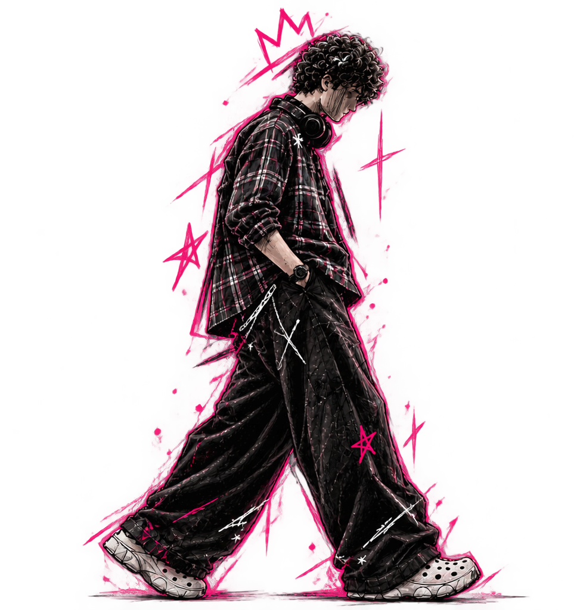</a>

<h3>SoulArt / KRTY</h3>
<h3>Maria Matveeva</h3>

<b>ГРАФИЧЕСКИЙ | МУЛЬТИДИСЦИПЛИНАРНЫЙ ДИЗАЙНЕР</b>

Превращаю идеи в визуальные истории. Дизайн с характером. Без скучных решений.

<a href="https://t.me/designeramigo">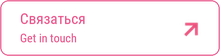</a>

РОССИЯ · В ДИЗАЙНЕ С 2022

 

### Работы

<a href="https://www.behance.net/gallery/246885793/Brand-Book-GxSoulKRTY">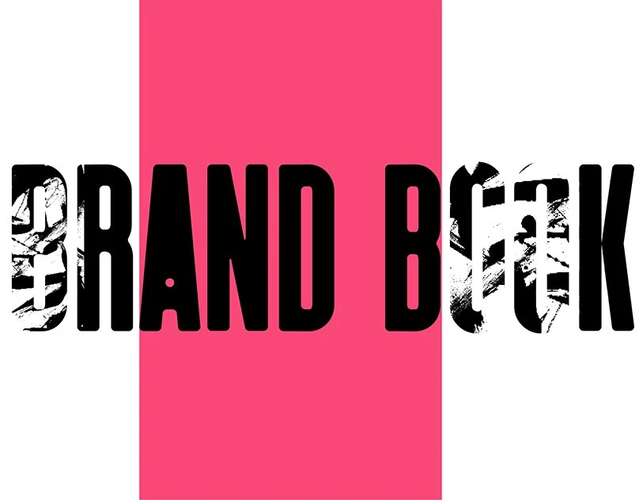</a>
<h3><a href="https://www.behance.net/gallery/246885793/Brand-Book-GxSoulKRTY">Brand Book GxSoul/KRTY</a></h3>

Айдентика и руководство по визуальному стилю.

 

<a href="https://www.behance.net/gallery/249997653/XFit-Rebranding">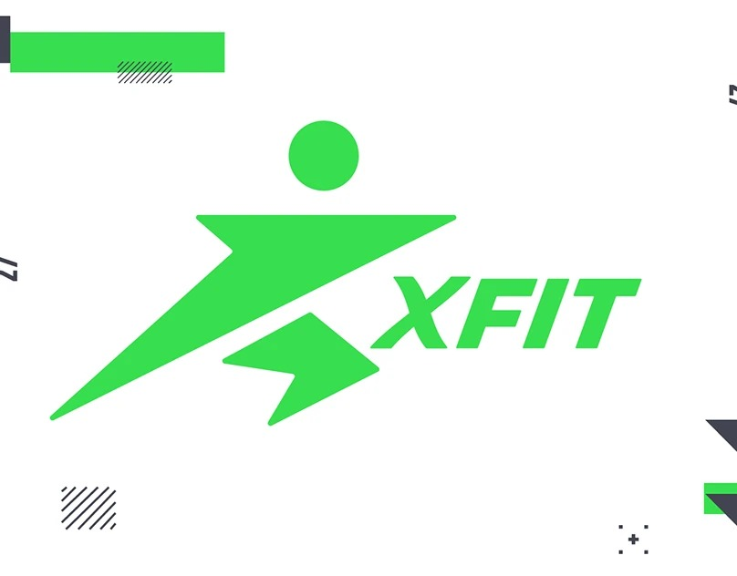</a>
<h3><a href="https://www.behance.net/gallery/249997653/XFit-Rebranding">XFit Rebranding</a></h3>

Концепция ребрендинга фитнес-сети · учебный проект.

 

<a href="https://www.behance.net/gallery/251160601/Portfolio-Website">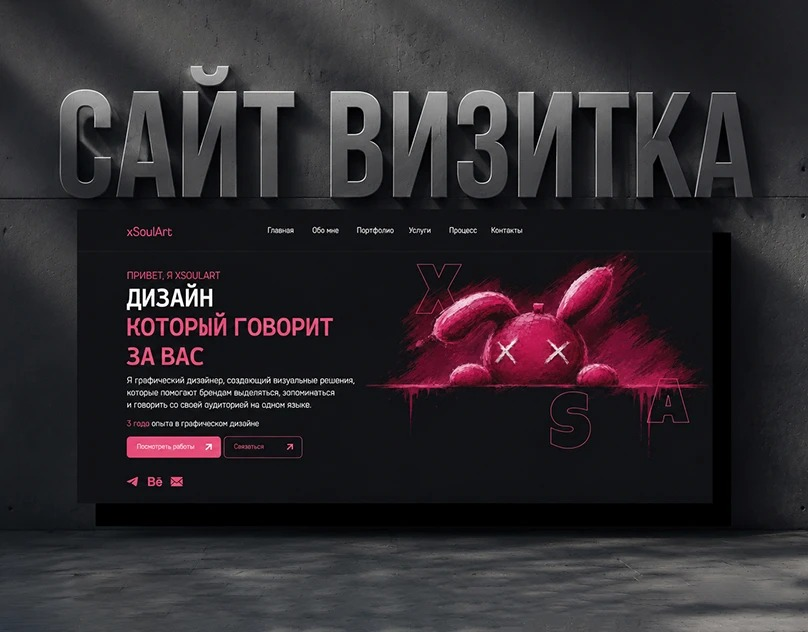</a>
<h3><a href="https://www.behance.net/gallery/251160601/Portfolio-Website">Portfolio Website</a></h3>

Сайт-портфолио · учебный проект.

 

<a href="https://www.behance.net/gallery/229126569/Journal-Full-fledged-layout-of-the-magazine">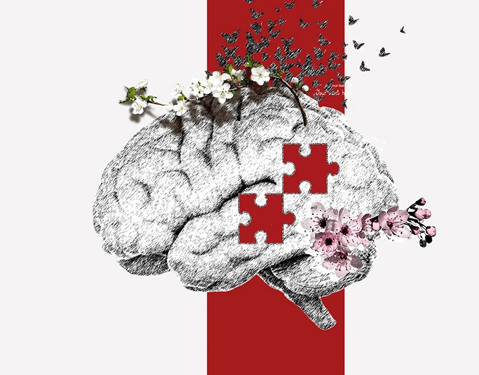</a>
<h3><a href="https://www.behance.net/gallery/229126569/Journal-Full-fledged-layout-of-the-magazine">Journal</a></h3>

Журнальная вёрстка и редакционный дизайн.

 

[Посмотреть всё портфолио →](https://www.behance.net/tuumiyurmirazh/projects)

### Обо мне

Я занимаюсь дизайном, создаю самые разные вещи и довожу каждый проект до действительно красивого результата. Если тебе нужен стильный, аккуратный и цепляющий визуал — ты по адресу.

· **Графический дизайнер** — постеры, обложки, карточки товаров и графика для соцсетей.  
· **UI/UX** — визуальное оформление сайтов и приложений.  
· **Айдентика** — логотипы и визуальный стиль.  
· **Редакционный дизайн** — журнальная вёрстка, композиция и типографика.  
· **Фотограф** — съёмка мероприятий и портретов.

В дизайне с 2022 года. Я из России, развиваю навыки через личные и учебные проекты и открыта к творческому сотрудничеству.

**Связь со мной:** [@designeramigo](https://t.me/designeramigo)  
**Мои работы в Telegram:** [@soulamigo](https://t.me/soulamigo)  
**TikTok с фотографиями:** [@xkartaviyx_](https://www.tiktok.com/@xkartaviyx_) · **Instagram:** [@xgxsoul_kartaviyx](https://www.instagram.com/xgxsoul_kartaviyx/)

### Направления

<a href="https://t.me/designeramigo">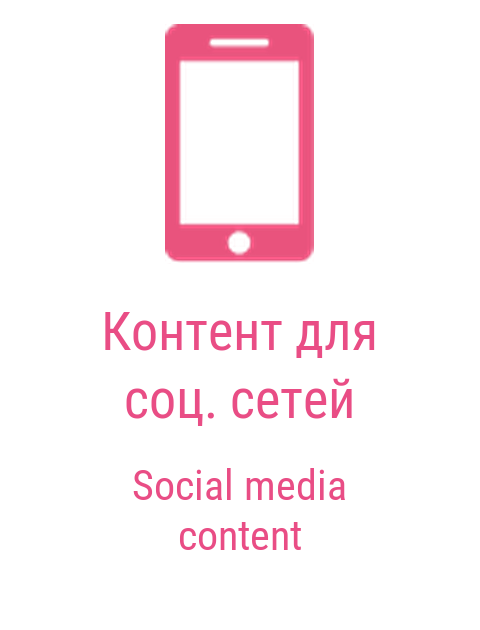</a> &nbsp;
<a href="https://t.me/designeramigo">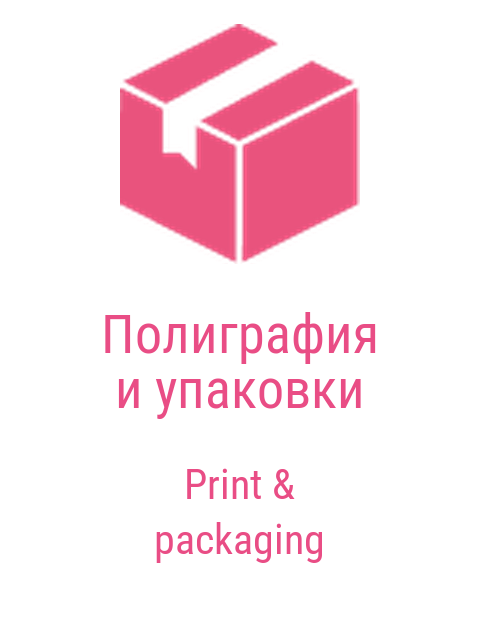</a> &nbsp;
<a href="https://t.me/designeramigo">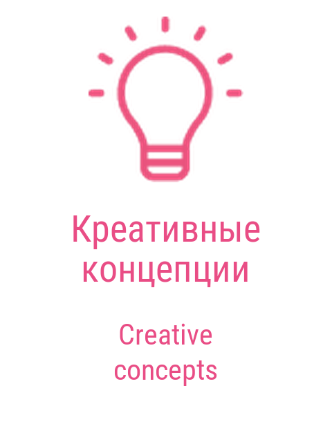</a> &nbsp;
<a href="https://t.me/designeramigo">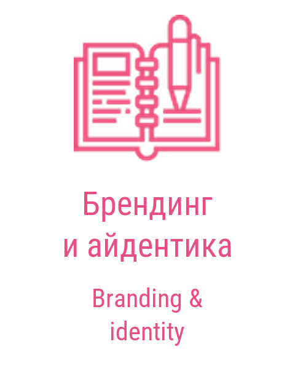</a> &nbsp;
<a href="https://t.me/designeramigo">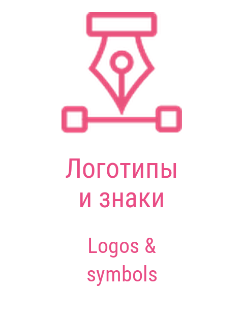</a> &nbsp;
<a href="https://t.me/designeramigo">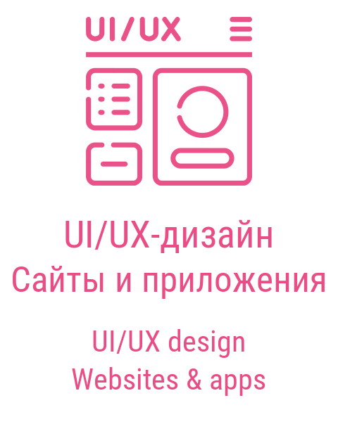</a>

### Инструменты и навыки

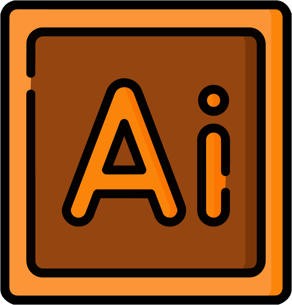 &nbsp;
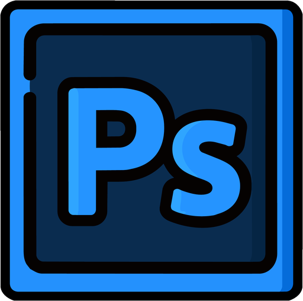 &nbsp;
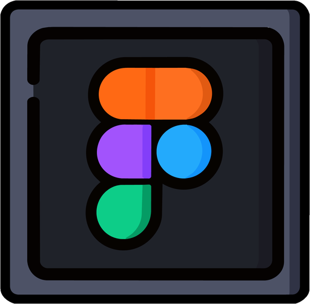 &nbsp;
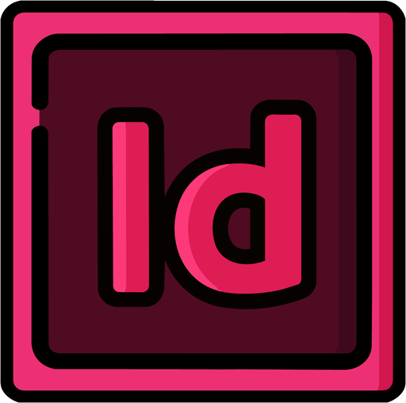 &nbsp;
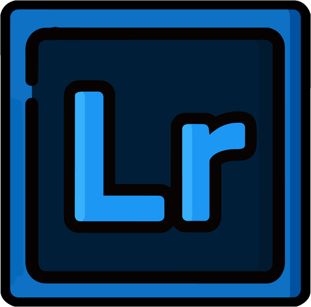 &nbsp;

Illustrator · Photoshop · Figma · InDesign · Lightroom

### Профессиональные навыки

**Основа визуала**

- Композиция и иерархия
- Типографика
- Цветокоррекция и гармония
- Вёрстка и работа с сетками

**Практика дизайна**

- Работа с референсами и мудбордами
- Дизайн постеров и баннеров
- Разработка айдентики и логотипов
- Карточки товаров, обложки и контент для соцсетей
### Soft skills

- Креативное мышление
- Внимание к деталям
- Работа с критикой и гибкость
- Тайм-менеджмент и ответственность
- Быстрая обучаемость

### Языки

**Русский** — Родной  
**Английский** — Базовый

### Опыт и образование

### Опыт

- **Графический дизайнер · BeePro · 2023** — Карточки товаров для сайта.
- **Фотограф · Колледж · 2025–2026** — Съёмка мероприятий и портретов.
- **Графический дизайнер · Колледж · С 2026 года** — Создание карточек и визуальных материалов.

### Образование

**IT TOP Academy · Графический дизайн · 2023–2025**  
Композиция, типографика, цвет, айдентика и digital-дизайн. Практика и современные подходы.

### RE: FORM — авторская студия одного человека

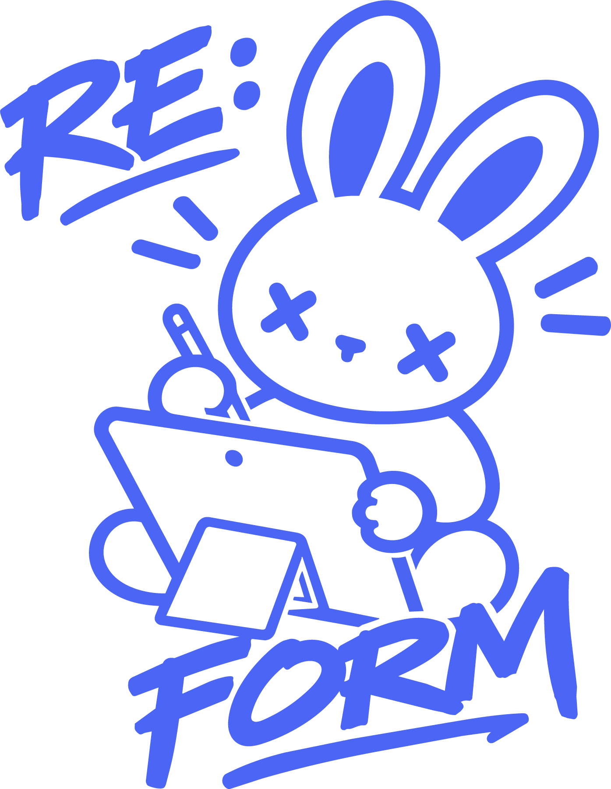
<h3>МОЯ КОМАНДА — RE: FORM</h3>
<b>RE: FORM</b> — это не команда в классическом смысле. Это <b>мой личный проект</b>, где я выступаю одновременно дизайнером, разработчиком, менеджером и идейным вдохновителем.

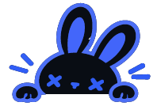

<b>Участник проекта: Я — основатель и единственный исполнитель.</b>

 

- **Роль:** Project Lead, UI/UX-дизайнер, Full-stack разработчик.
- **Команда:** RE: FORM — авторский проект, реализуемый силами одного человека.
- **Зона ответственности:** Полный цикл создания продукта — от концепции и дизайна до написания кода и тестирования.

### Как я работаю

Я объединяю **дизайн и программирование** в одном процессе. Мне не нужно ждать разработчика или дизайнера — я делаю всё сама. А **ИИ (вайбкодинг)** помогает мне ускорить рутинные задачи, генерировать код и отлаживать его. Это позволяет одному человеку создавать полноценные приложения.

### Что это даёт

**Скорость** — Решения принимаются мгновенно, без согласований.

**Гибкость** — Я могу менять направление проекта на лету.

**Целостность** — Дизайн и код не конфликтуют — они создаются одним человеком.

**Уникальность** — Каждый проект — это моё видение от начала до конца.
### Философия RE: FORM

**Один человек + ИИ = полноценная студия.**

- Я не просто рисую интерфейсы — я их **оживляю**.
- Я не просто пишу код — я делаю его **красивым и удобным**.
- Моя цель — создавать **полезные приложения для жизни**, которые выходят за рамки чисто дизайна.

<a href="https://kartaamigo.github.io/#team">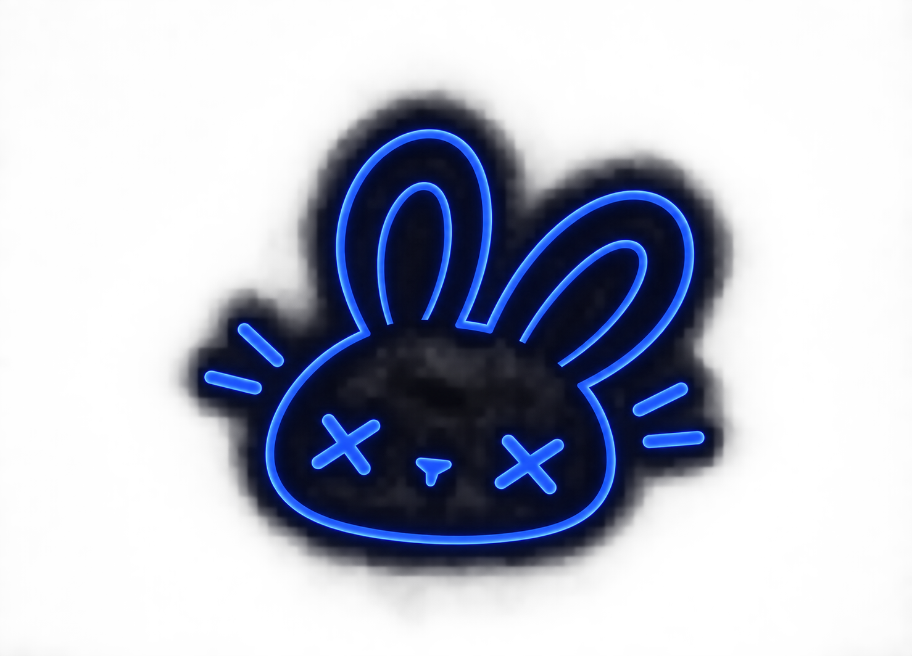</a>
<h3>RE: FORM LIFE</h3>
Интеллектуальная экосистема для планирования жизни с ИИ-ассистентом <b>EVE</b>.

<b>ДИЗАЙН · КОД · ИИ</b>

<a href="https://t.me/designeramigo">Обсудить проект ↗</a>

 

**RE: FORM**  
Твой путь к осознанным переменам.  
Дизайн. Код. ИИ. Всё в одном.  
Одна идея. Один человек. Один продукт.

### Давай создадим что-нибудь вместе

<a href="mailto:xghostxsoulx@gmail.com">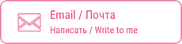</a>

Нужна айдентика, оформление издания или визуальные материалы? Расскажи о своей задаче.

[Behance](https://www.behance.net/tuumiyurmirazh/projects) · [Telegram](https://t.me/designeramigo) · [Почта](mailto:xghostxsoulx@gmail.com)

<i>Главное — живи! Не существуй ради оценок, зарплаты или одобрения. Живи так, чтобы каждый день, ложась спать, ты мог сказать: «Да, сегодня было круто!»</i>

<a href="https://kartaamigo.github.io/"><b>Открыть интерактивное портфолио ↗</b></a>

