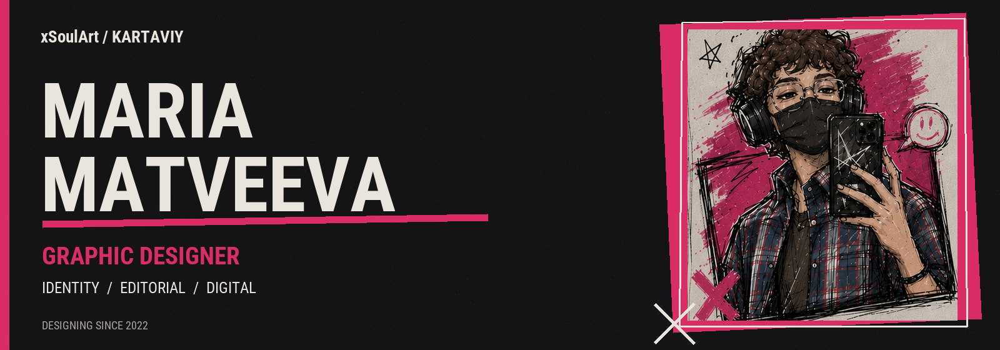

<b>English</b> · <a href="README.ru.md">Русский</a>

## Hi, I'm Maria.

I'm a graphic designer working on visual identities, editorial layouts and digital graphics. I've been exploring graphic design since 2022, with a focus on composition, typography and color. I like visuals with character — and a clear purpose behind every detail.

My experience includes product cards, posters, covers, social media graphics, and event and portrait photography. I'm open to design projects and creative collaborations.

[Behance](https://www.behance.net/tuumiyurmirazh/projects) · [Telegram](https://t.me/designeramigo) · [Email](mailto:xghostxsoulx@gmail.com)

## Selected work

<table>
<tr>
<td width="50%" valign="top">

<h3><a href="https://www.behance.net/gallery/246885793/Brand-Book-GxSoulKRTY">Brand Book GxSoul/KRTY</a></h3>

Brand identity and brand guidelines.

</td>
<td width="50%" valign="top">

<h3><a href="https://www.behance.net/gallery/249997653/XFit-Rebranding">XFit Rebranding</a></h3>

Fitness brand rebranding concept · college project.

</td>
</tr>
<tr>
<td width="50%" valign="top">

<h3><a href="https://www.behance.net/gallery/251160601/Portfolio-Website">Portfolio Website</a></h3>

Portfolio website · college project.

</td>
<td width="50%" valign="top">

<h3><a href="https://www.behance.net/gallery/229126569/Journal-Full-fledged-layout-of-the-magazine">Journal</a></h3>

Magazine layout and editorial design.

</td>
</tr>
</table>

[Explore my full portfolio →](https://www.behance.net/tuumiyurmirazh/projects)

## What I work with

**Tools** · Adobe Photoshop · Illustrator · InDesign · Lightroom · Figma

**Focus** · Visual identity & logo design · Typography & layout · Posters & banners · Social media graphics · Color correction

<b>Experience & education</b>

### Experience

- **Graphic designer · BeePro · 2023** — Product cards for a website.
- **Photographer · College · 2025–2026** — Event and portrait photography.
- **Graphic designer · College · Since 2026** — Cards and visual materials.

### Education

**IT TOP Academy · Graphic Design · 2023–2025**  
Composition, typography, color, visual identity and digital design.

## Let's create something together

Have a brand, publication or visual project in mind? Tell me about it.

[Behance](https://www.behance.net/tuumiyurmirazh/projects) · [Telegram](https://t.me/designeramigo) · [Email](mailto:xghostxsoulx@gmail.com)

---

<i>Experience is growing. The style is already mine.</i>

