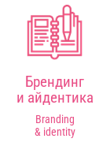
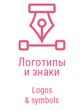
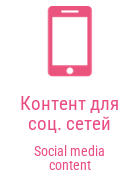
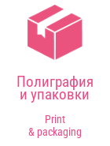
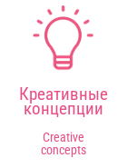

<b>English</b> · <a href="README.ru.md">Русский</a>

<h1 align="center">SoulArt / KRTY || Maria</h1>

<b>GRAPHIC | MULTIDISCIPLINARY DESIGNER</b>

## Welcome, I'm SoulArt / KRTY || Maria 👋

I work in design, create all kinds of things and refine every project into something beautiful. If you're looking for visuals that are stylish, polished and eye-catching, you're in the right place.

· **Graphic designer** — posters, covers, product cards and social media graphics.  
· **UI/UX** — visual design for websites and apps.  
· **Visual identity** — logos and brand visuals.  
· **Editorial design** — magazine layouts, composition and typography.  
· **Photographer** — events and portraits.

Based in Russia and designing since 2022. I develop my skills through personal and academic projects and welcome creative collaborations.

**Contact me:** [@designerpooh](https://t.me/designerpooh)  
**My work on Telegram:** [@soulamigo](https://t.me/soulamigo)  
**Photography on TikTok:** [@xkartaviyx_](https://www.tiktok.com/@xkartaviyx_) · **Instagram:** [@xgxsoul_kartaviyx](https://www.instagram.com/xgxsoul_kartaviyx/)

## Design services / Направления

## Selected work

<table>
<tr>
<td width="50%" valign="top">

<h3><a href="https://www.behance.net/gallery/246885793/Brand-Book-GxSoulKRTY">Brand Book GxSoul/KRTY</a></h3>

Brand identity and brand guidelines.

</td>
<td width="50%" valign="top">

<h3><a href="https://www.behance.net/gallery/249997653/XFit-Rebranding">XFit Rebranding</a></h3>

Fitness brand rebranding concept · college project.

</td>
</tr>
<tr>
<td width="50%" valign="top">

<h3><a href="https://www.behance.net/gallery/251160601/Portfolio-Website">Portfolio Website</a></h3>

Portfolio website · college project.

</td>
<td width="50%" valign="top">

<h3><a href="https://www.behance.net/gallery/229126569/Journal-Full-fledged-layout-of-the-magazine">Journal</a></h3>

Magazine layout and editorial design.

</td>
</tr>
</table>

[Explore my full portfolio →](https://www.behance.net/tuumiyurmirazh/projects)

## What I work with

 &nbsp;
 &nbsp;
 &nbsp;
 &nbsp;
 &nbsp;

Photoshop · Illustrator · InDesign · Lightroom · Figma

### Design skills

| Visual foundations | Creative practice |
| :--- | :--- |
| Composition & visual hierarchy | Reference research & moodboards |
| Typography | Poster & banner design |
| Color correction & color harmony | Visual identities & logos |
| Layout & grid systems | Product cards, covers & social media graphics |

### Soft skills

- Creative thinking
- Attention to detail
- Openness to feedback and flexible thinking
- Time management and responsibility
- Fast learning

### Languages

**Russian** — Native  
**English** — Basic

## Experience & education

### Experience

- **Graphic designer · BeePro · 2023** — Product cards for a website.
- **Photographer · College · 2025–2026** — Event and portrait photography.
- **Graphic designer · College · Since 2026** — Cards and visual materials.

### Education

**IT TOP Academy · Graphic Design · 2023–2025**  
Composition, typography, color, visual identity and digital design. Practical work and contemporary design approaches.

## Let's create something together

Have a brand, publication or visual project in mind? Tell me about it.

[Behance](https://www.behance.net/tuumiyurmirazh/projects) · [Telegram](https://t.me/designerpooh) · [Email](mailto:xghostxsoulx@gmail.com)

---

<i>Above all, live! Do not live only for grades, a salary or approval. Live so that every night you can say: “Yes, today was great!”</i>

