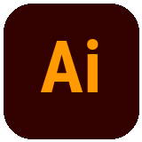
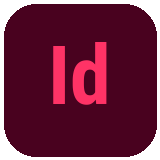
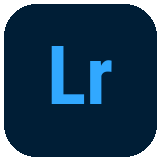

<a href="README.md">English</a> · <b>Русский</b>

<h1 align="center">Мария Матвеева</h1>

<b>ГРАФИЧЕСКИЙ | МУЛЬТИДИСЦИПЛИНАРНЫЙ ДИЗАЙНЕР</b>

## Привет, я Мария 👋

Я графический и мультидисциплинарный дизайнер, развиваюсь в дизайне с 2022 года. Работаю на пересечении айдентики, редакционного и digital-дизайна: от логотипов, постеров и журнальной вёрстки до визуального оформления сайтов и приложений. Фотография — ещё одна часть моей творческой практики: снимаю мероприятия и портреты.

Мне нравится собирать целостный визуальный образ через композицию, типографику и цвет. Ищу идеи в референсах, продумываю детали и стремлюсь к тому, чтобы дизайн был выразительным, понятным и помогал решать конкретную задачу. Развиваю навыки в личных и учебных проектах, открыта к сотрудничеству и новым творческим задачам.

- 🎨 **Создаю:** айдентику, постеры, обложки и графику для соцсетей.
- 📷 **Снимаю:** мероприятия и портреты.
- 🌱 **Развиваюсь:** через личные и учебные проекты, новые навыки и изучение дизайна.
- ✉️ **Открыта к:** дизайн-проектам и творческому сотрудничеству.

[Behance](https://www.behance.net/tuumiyurmirazh/projects) · [Telegram](https://t.me/designeramigo) · [Почта](mailto:xghostxsoulx@gmail.com)

## Избранные работы

<table>
<tr>
<td width="50%" valign="top">

<h3><a href="https://www.behance.net/gallery/246885793/Brand-Book-GxSoulKRTY">Brand Book GxSoul/KRTY</a></h3>

Айдентика и руководство по визуальному стилю.

</td>
<td width="50%" valign="top">

<h3><a href="https://www.behance.net/gallery/249997653/XFit-Rebranding">XFit Rebranding</a></h3>

Концепция ребрендинга фитнес-сети · учебный проект.

</td>
</tr>
<tr>
<td width="50%" valign="top">

<h3><a href="https://www.behance.net/gallery/251160601/Portfolio-Website">Portfolio Website</a></h3>

Сайт-портфолио · учебный проект.

</td>
<td width="50%" valign="top">

<h3><a href="https://www.behance.net/gallery/229126569/Journal-Full-fledged-layout-of-the-magazine">Journal</a></h3>

Журнальная вёрстка и редакционный дизайн.

</td>
</tr>
</table>

[Посмотреть всё портфолио →](https://www.behance.net/tuumiyurmirazh/projects)

## С чем работаю

 &nbsp;
 &nbsp;
 &nbsp;
 &nbsp;
 &nbsp;

Photoshop · Illustrator · InDesign · Lightroom · Figma

### Профессиональные навыки

| Основа визуала | Практика дизайна |
| :--- | :--- |
| Композиция и иерархия | Работа с референсами и мудбордами |
| Типографика | Дизайн постеров и баннеров |
| Цветокоррекция и гармония | Разработка айдентики и логотипов |
| Вёрстка и работа с сетками | Карточки товаров, обложки и контент для соцсетей |

### Soft skills

- Креативное мышление
- Внимание к деталям
- Работа с критикой и гибкость
- Тайм-менеджмент и ответственность
- Быстрая обучаемость

### Языки

**Русский** — Родной  
**Английский** — Базовый

## Опыт и образование

### Опыт

- **Графический дизайнер · BeePro · 2023** — Карточки товаров для сайта.
- **Фотограф · Колледж · 2025–2026** — Съёмка мероприятий и портретов.
- **Графический дизайнер · Колледж · С 2026 года** — Создание карточек и визуальных материалов.

### Образование

**IT TOP Academy · Графический дизайн · 2023–2025**  
Композиция, типографика, цвет, айдентика и digital-дизайн. Практика и современные подходы.

## Давай создадим что-нибудь вместе

Нужна айдентика, оформление издания или визуальные материалы? Расскажи о своей задаче.

[Behance](https://www.behance.net/tuumiyurmirazh/projects) · [Telegram](https://t.me/designeramigo) · [Почта](mailto:xghostxsoulx@gmail.com)

---

<i>Опыт приходит. Стиль уже со мной.</i>

